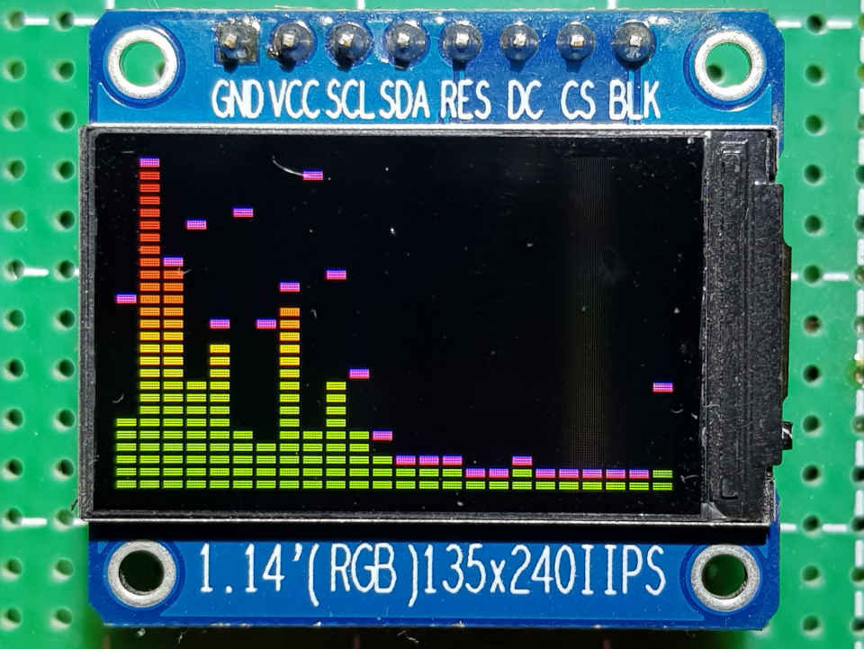
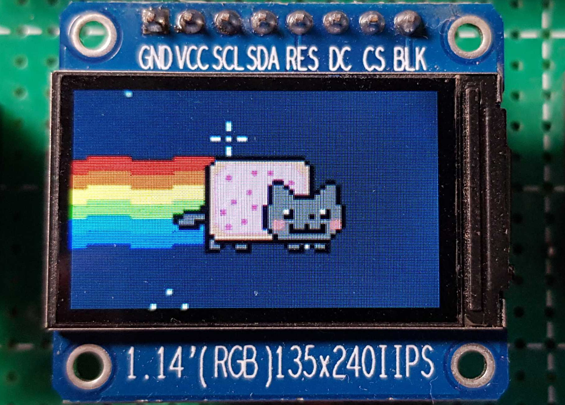
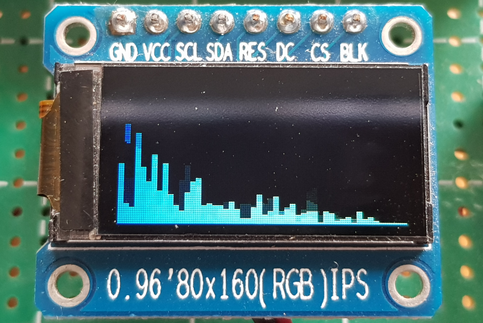
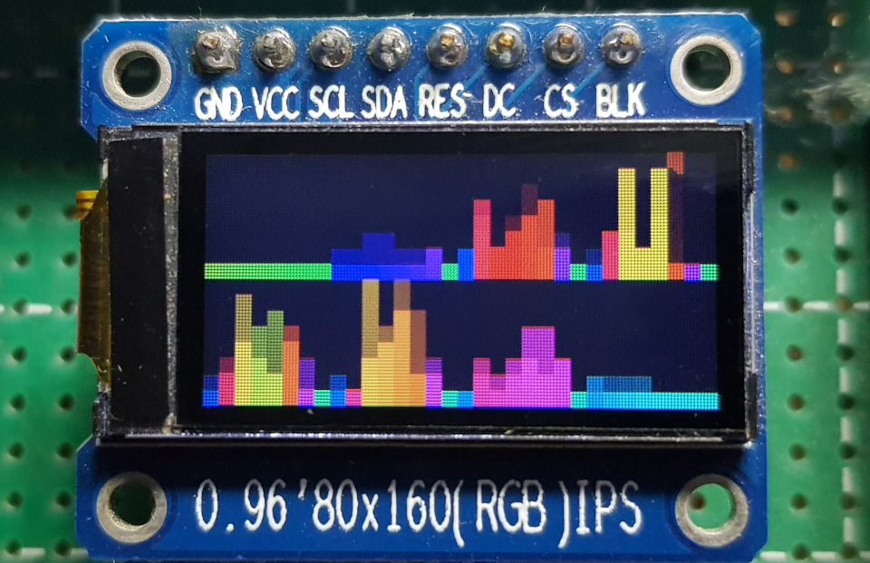
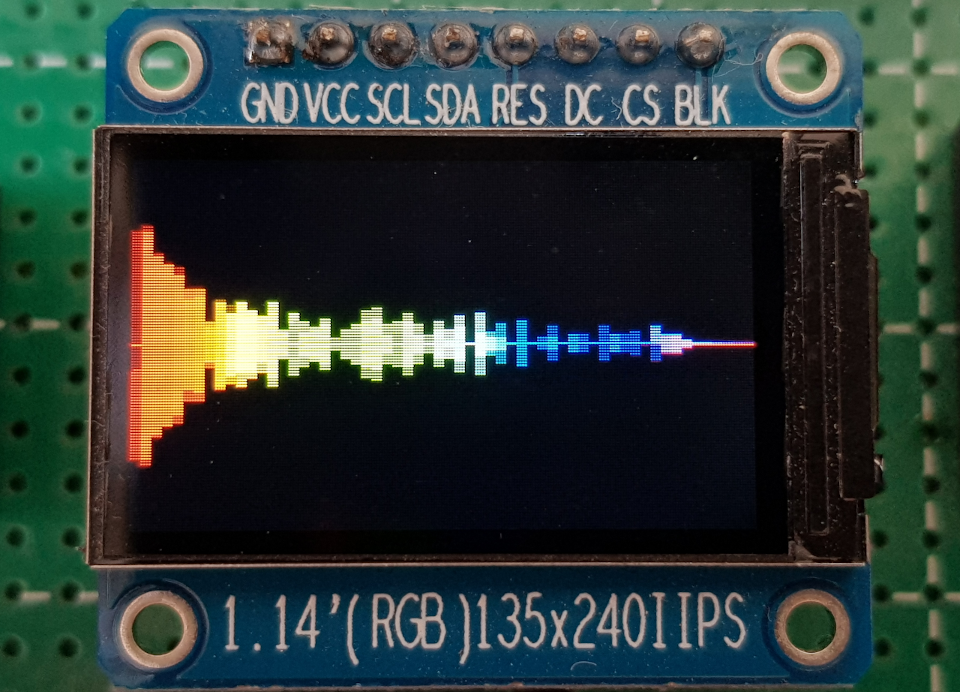
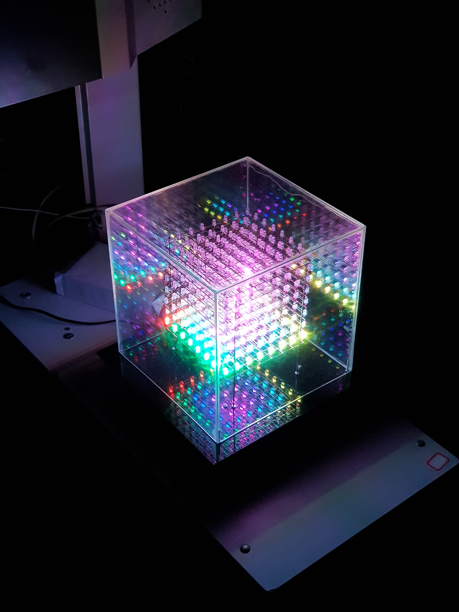

Visual Effects Controller
=========================

Visual Effects Controller based on ESP32 chip.

## Main Features

* Bluetooth A2DP Audio Streaming
* I2S & PDM Input / I2S Output
* VFX Output (GIF / Audio FFT / Rainbow / Star Sky / ...)
* BLE Control Interface (for VFX Output)
* Audio Prompt (Connected / Disconnected / WakeUp / Sleep)
* OTA Firmware Update (via SPP Profile)
* Sleep & WakeUp Key

## Preparing

### Obtain the Source

```
git clone --recursive https://github.com/redchenjs/visual_effects_controller_esp32.git
```

### Update an existing repository

```
git pull
git submodule update --init --recursive
```

### Setup the Tools

```
./esp-idf/install.sh
```

## Building

### Setup the environment variables

```
export IDF_PATH=$PWD/esp-idf
source ./esp-idf/export.sh
```

### Configure

```
idf.py menuconfig
```

* All project configurations are under the `Visual Effects Controller` menu.

### Flash & Monitor

```
idf.py flash monitor
```

## VFX on ST7789 135x240 LCD Panel (VU Meter)



## VFX on ST7789 135x240 LCD Panel (GIF)



## VFX on ST7735 80x160 LCD Panel (Linear Spectrum)



## VFX on ST7735 80x160 LCD Panel (CUBE0414 Simulation)



## VFX on ST7789 135x240 LCD Panel (Logarithmic Spectrum)



## VFX on CUBE0414 8x8x8 Music Light Cube



## Mini-Program Code


## Videos Links

* [音乐全彩光立方演示](https://www.bilibili.com/video/av25188707)
* [音乐全彩光立方配套微信小程序](https://www.bilibili.com/video/av83055233)
