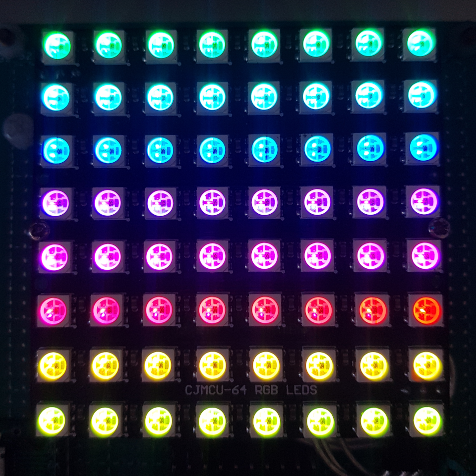

Bluetooth Visual Speaker
========================

Bluetooth Visual Speaker based on ESP32 chip.

## Main Features

* A2DP audio streaming
* I2S & PDM input / I2S output
* VFX output (GIFs / Audio FFT / Rainbow / Starsky / ...)
* BLE control interface (OTA firmware update / VFX remote control)
* Audio prompt (Connected / Disconnected / Sleep / Wake-Up)
* Sleep & Wake-Up key

## Preparing

### Obtain the source

```
git clone --recursive https://github.com/redchenjs/bluetooth_visual_speaker_esp32.git
```

### Update an existing repository

```
git pull
git submodule update --init --recursive
```

### Setup the tools

```
./esp-idf/install.sh
```

## Building

### Setup the environment variables

```
export IDF_PATH=$PWD/esp-idf
source ./esp-idf/export.sh
```

### Configure

```
idf.py menuconfig
```

* All project configurations are under the `Bluetooth Visual Speaker` menu.

### Flash & Monitor

```
idf.py flash monitor
```

## VFX on ST7789 135x240 LCD Panel (VU Meter)


## VFX on ST7789 135x240 LCD Panel (GIF)


## VFX on ST7735 80x160 LCD Panel (Linear Spectrum)


## VFX on ST7789 135x240 LCD Panel (Logarithmic Spectrum)


## VFX on WS2812 8x8 LED Panel (Rainbow)



## VFX on CUBE0414 8x8x8 Music Light Cube


## Mini-Program Code


## Videos Links

* [音乐全彩光立方演示](https://www.bilibili.com/video/av25188707) ([YouTube](https://www.youtube.com/watch?v=F8nfA_mEhPg))
* [音乐全彩光立方配套微信小程序](https://www.bilibili.com/video/av83055233) ([YouTube](https://www.youtube.com/watch?v=HlruQqkIGtc))
