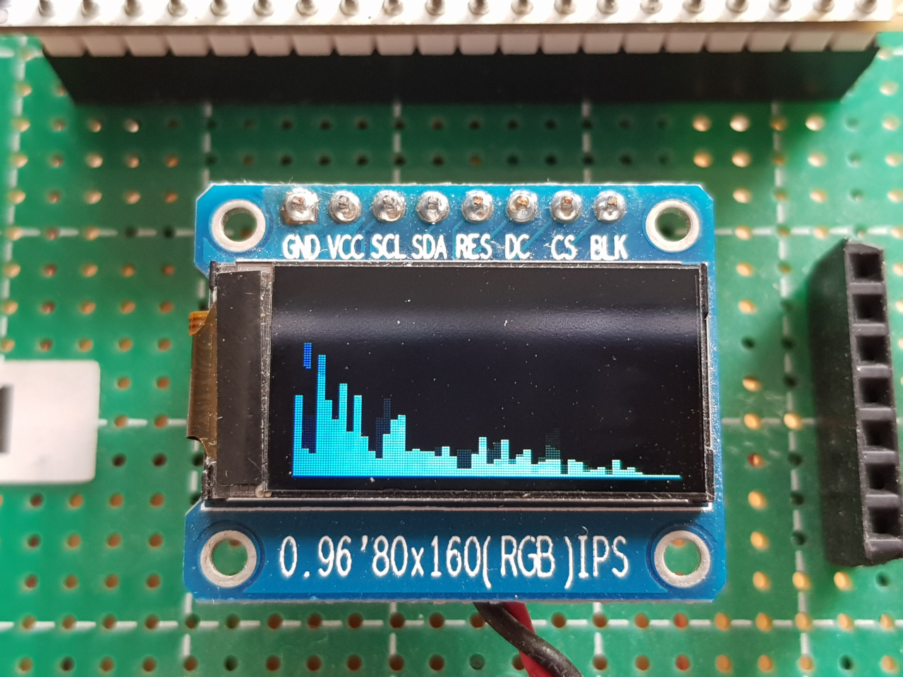

Bluetooth Speaker
=================

Bluetooth Speaker based on ESP32 chip with optional visual effects output.

## Main Features

* A2DP Audio Streaming
* I2S/PDM Input / I2S Output
* VFX Output (Audio FFT / Rainbow / Stars / ...)
* BLE Control Interface (for VFX Output)
* Audio Prompt (Connected / Disconnected / Resume / Sleep)
* Sleep/Resume (with External Key)
* OTA Firmware Update (via SPP Profile)

## Obtaining

```
git clone --recursive https://github.com/redchenjs/bluetooth_speaker_esp32.git
```

* Set up the Toolchain: <https://docs.espressif.com/projects/esp-idf/en/latest/get-started/index.html>

## Configure

```
./esp-idf/tools/idf.py menuconfig
```

* All project configurations are under the `Bluetooth Speaker` menu.

## Build & Flash & Monitor

```
./esp-idf/tools/idf.py flash monitor
```

## Music VFX on ST7735 80x160 LCD Panel (Realtime FFT)



## Music VFX on CUBE0414 RGB Light Cube


## Videos Links

* [音乐全彩光立方演示](https://www.bilibili.com/video/av25188707)
